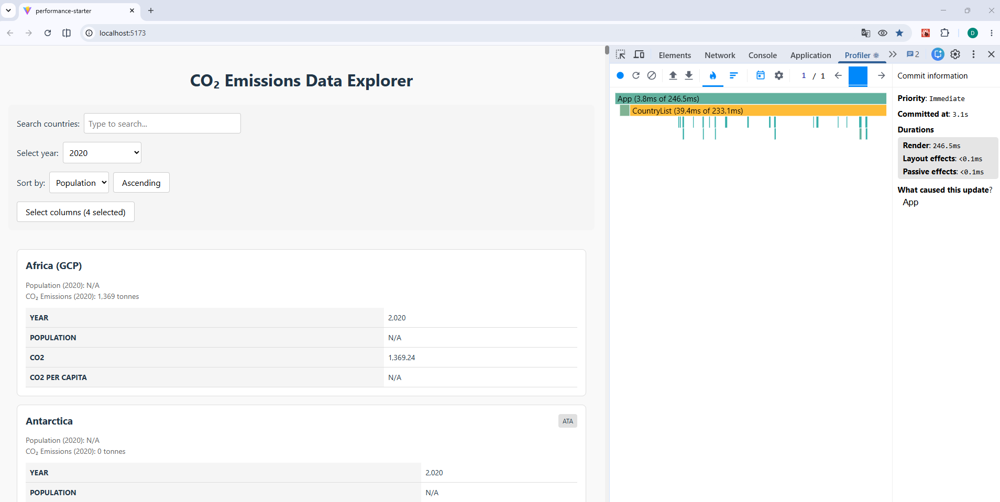
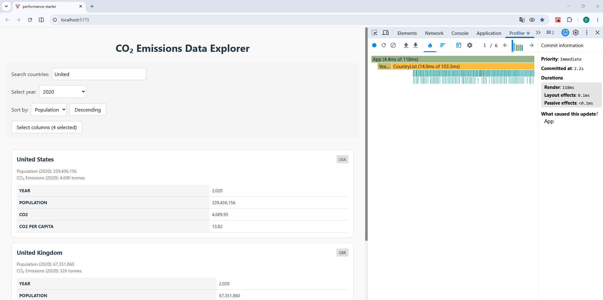
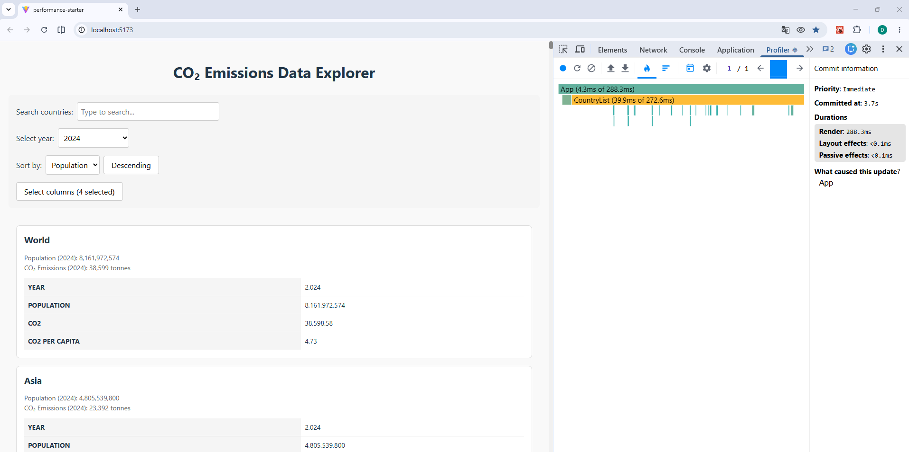
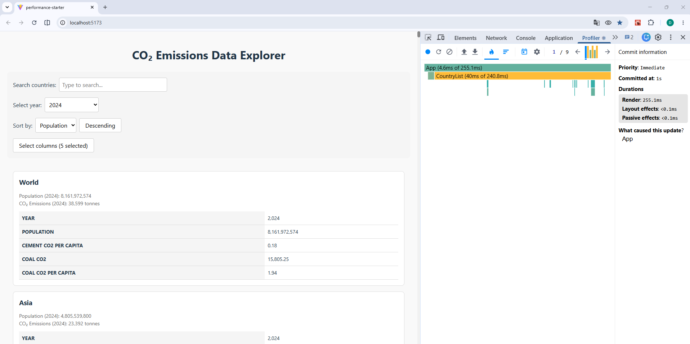
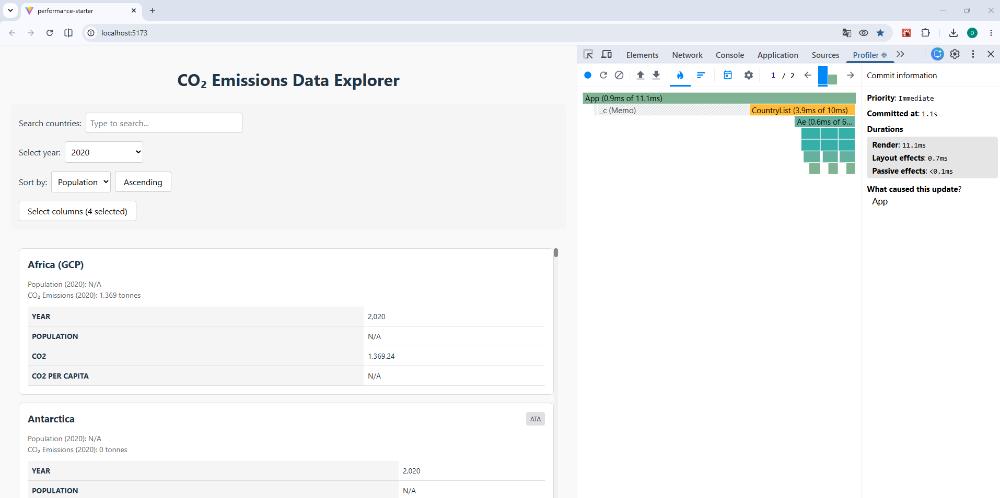
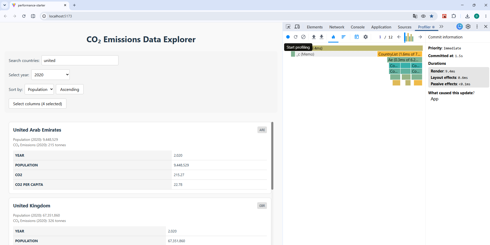
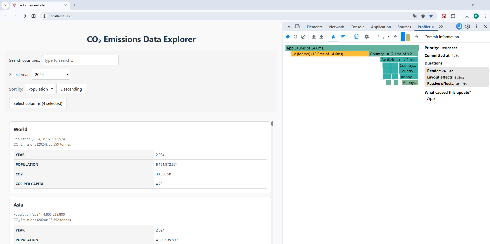
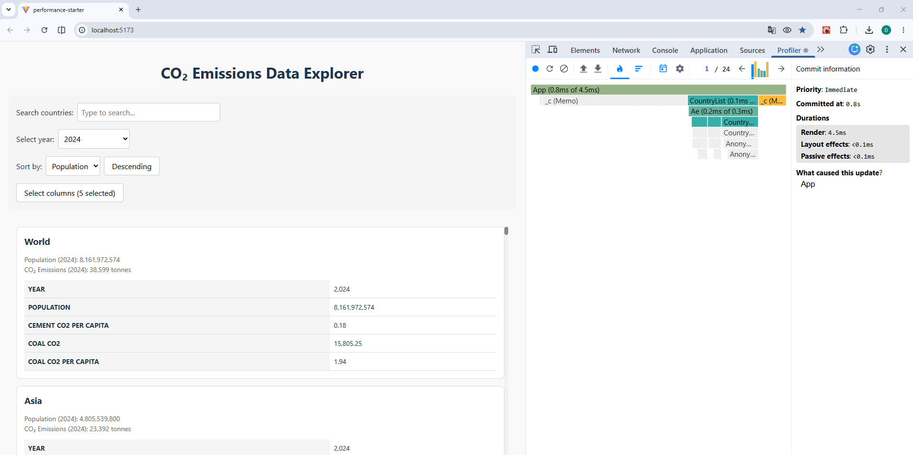

# Performance Optimization Report

## Baseline Measurements

### Interaction A: Sort countries

- **Commit duration**: N/A (The React DevTools version used for profiling does not expose a separate Commit Duration metric.)
- **Render duration**: 246.5ms
- **Screenshot**: 

### Interaction B: Search countries

- **Commit duration**: N/A (The React DevTools version used for profiling does not expose a separate Commit Duration metric.)
- **Render duration**: 118ms
- **Screenshot**: 

### Interaction C: Change year

- **Commit duration**: N/A (The React DevTools version used for profiling does not expose a separate Commit Duration metric.)
- **Render duration**: 288.3ms
- **Screenshot**: 

### Interaction D: Toggle column

- **Commit duration**: N/A (The React DevTools version used for profiling does not expose a separate Commit Duration metric.)
- **Render duration**: 255.1ms
- **Screenshot**: 

## Optimized Measurements

### Interaction A: Sort countries

- **Commit duration**: N/A (The React DevTools version used for profiling does not expose a separate Commit Duration metric.)
- **Render duration**: 11.1ms
- **Screenshot**: 

### Interaction B: Search countries

- **Commit duration**: N/A (The React DevTools version used for profiling does not expose a separate Commit Duration metric.)
- **Render duration**: 9.4ms
- **Screenshot**: 

### Interaction C: Change year

- **Commit duration**: N/A (The React DevTools version used for profiling does not expose a separate Commit Duration metric.)
- **Render duration**: 24.6ms
- **Screenshot**: 

### Interaction D: Toggle column

- **Commit duration**: N/A (The React DevTools version used for profiling does not expose a separate Commit Duration metric.)
- **Render duration**: 4.5ms
- **Screenshot**: 

## Summary of Improvements

| Interaction      | Baseline (ms) | Optimized (ms) | Improvement |
| ---------------- | ------------- | -------------- | ----------- |
| Sort countries   | 246.5        | 11.1            | 95.5%       |
| Search countries | 118          | 9.4             | 92.0%       |
| Change year      | 288.3        | 24.6            | 91.5%       |
| Toggle column    | 255.1        | 4.5             | 98.2%       |
| **Average**      | **227**      | **12.4**        | **94.5%**   |